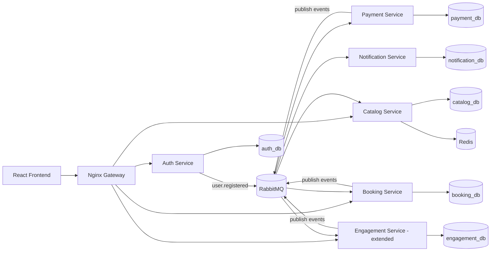

# Travel Booking System: Design Doc

A microservices-based travel booking app (flights + hotels) built to learn Docker, service boundaries, and event-driven communication. Runs fully local with `docker compose up`. No hosting needed.

---

## 1. Goals & Non-Goals

**Goals**
- Practice microservice architecture with clear service boundaries
- Practice Docker: multi-stage builds, healthchecks, compose networking, volumes
- Practice async communication (RabbitMQ) and the saga pattern (booking -> payment -> confirm/rollback)
- Full-stack flow: React UI -> gateway -> Express services -> Postgres

**Non-Goals**
- Real payments (payment service is a mock)
- Real email/SMS (notification service logs / uses Mailpit)
- Cloud hosting, Kubernetes, multi-region anything

---

## 2. Tech Stack

| Layer | Choice | Why |
|---|---|---|
| Frontend | React + Vite, React Router, TanStack Query, Axios | Fast dev, clean server-state handling |
| Backend | Node.js 20 + Express (JavaScript) | As planned; one language everywhere |
| Database | PostgreSQL (one DB per service) | Enforces service isolation |
| Message broker | RabbitMQ (`amqplib`) | Easy to run locally, nice management UI |
| Cache / locks | Redis | Short-lived seat/room holds with TTL |
| Gateway | Nginx (reverse proxy) | Single entry point, simple config |
| Auth | JWT (access token) + bcrypt | Stateless, works across services |
| Validation | Zod | Request validation in each service |
| DB access | `pg` + plain SQL migrations (or Prisma if you prefer) | Keep it simple and visible |
| Testing | Jest + Supertest | Unit + API tests |
| CI | GitHub Actions | Build + test images with no hosting |
| Local email | Mailpit (optional) | See notification emails in a browser |
| Observability (optional) | Prometheus + Grafana | Nice portfolio touch |

---

## 3. Architecture



### Services

| Service | Responsibility | Owns |
|---|---|---|
| **auth-service** | Register, login, JWT issue, profile | `users` |
| **catalog-service** | Flights/hotels search, availability, seat/room holds | `flights`, `hotels`, `rooms`, `inventory` |
| **booking-service** | Create/cancel bookings, booking state machine, saga coordinator | `bookings`, `booking_items` |
| **payment-service** | Mock payment processing, refunds | `payments` |
| **notification-service** | Consume events, send/log emails, e-ticket PDFs, real-time SSE stream, store history | `notifications` |
| **engagement-service** *(extended)* | Wishlist, reviews & ratings, price alerts, loyalty points | `wishlist`, `reviews`, `price_alerts`, `loyalty_accounts`, `loyalty_ledger` |

**Rules**
- A service never reads another service's database. It uses HTTP or events.
- Each service has its own `Dockerfile`, `package.json`, and migrations.
- JWT is verified in each service with a shared secret (simple). Gateway only routes.

---

## 4. Booking Flow (Saga, choreography style)

```
1. User clicks "Book"  -> POST /api/bookings
2. booking-service: creates booking (status = PENDING), asks catalog to HOLD inventory
3. booking-service publishes  booking.created
4. payment-service consumes booking.created -> runs mock payment
      success -> publishes payment.succeeded
      failure -> publishes payment.failed
5. booking-service consumes:
      payment.succeeded -> status = CONFIRMED, publishes booking.confirmed
      payment.failed    -> status = CANCELLED, publishes booking.cancelled
6. catalog-service consumes:
      booking.confirmed -> converts hold into real reservation
      booking.cancelled -> releases hold
7. notification-service consumes booking.confirmed / booking.cancelled -> sends email
```

**Booking states:** `PENDING -> CONFIRMED` | `PENDING -> CANCELLED` | `CONFIRMED -> CANCELLED` (user cancel, triggers refund)

**Failure handling**
- **Hold expiry:** holds live in Redis with a TTL (e.g. 10 min). If payment never arrives, the hold expires and a scheduled job marks the booking `EXPIRED`.
- **Idempotency:** every event has an `eventId`; consumers store processed IDs and skip duplicates.
- **Retries / DLQ:** failed messages are retried a few times, then land in a dead-letter queue.

---

## 5. Data Models (simplified)

**auth_db**
```
users(id UUID PK, name, email UNIQUE, password_hash, role, created_at)
```

**catalog_db**
```
flights(id, airline, origin, destination, departs_at, arrives_at, price, seats_total)
hotels(id, name, city, rating)
rooms(id, hotel_id FK, type, price_per_night, rooms_total)
reservations(id, item_type, item_id, booking_id, quantity, date_from, date_to)
```
Redis keys: `hold:{itemType}:{itemId}:{bookingId}` with TTL.

**booking_db**
```
bookings(id UUID PK, user_id, status, total_amount, created_at, updated_at)
booking_items(id, booking_id FK, item_type, item_id, quantity, unit_price, date_from, date_to)
processed_events(event_id PK, processed_at)
```

**payment_db**
```
payments(id, booking_id, amount, status, created_at)
processed_events(event_id PK, processed_at)
```

**notification_db**
```
notifications(id, user_id, type, payload JSONB, status, created_at)
processed_events(event_id PK, processed_at)
```

---

## 6. API Design (through gateway at `/api`)

**Auth**
| Method | Path | Description |
|---|---|---|
| POST | `/api/auth/register` | Create account |
| POST | `/api/auth/login` | Returns JWT |
| GET | `/api/auth/me` | Current user |

**Catalog**
| Method | Path | Description |
|---|---|---|
| GET | `/api/catalog/flights?from=&to=&date=` | Search flights |
| GET | `/api/catalog/hotels?city=&checkIn=&checkOut=` | Search hotels |
| GET | `/api/catalog/flights/:id` | Flight detail + availability |
| GET | `/api/catalog/hotels/:id` | Hotel detail + rooms |

**Booking** (auth required)
| Method | Path | Description |
|---|---|---|
| POST | `/api/bookings` | Create booking (starts saga) |
| GET | `/api/bookings` | My bookings |
| GET | `/api/bookings/:id` | Booking detail + status |
| POST | `/api/bookings/:id/cancel` | Cancel booking |

**Payment / Notification** are mostly internal (event-driven). Optional read endpoints: `GET /api/payments/:bookingId`, `GET /api/notifications`.

**Standard response shape**
```json
{ "success": true, "data": {}, "error": null }
```

---

## 7. Event Contracts (RabbitMQ)

Exchange: `travel.events` (topic). Routing key = event name.

```json
{
  "eventId": "uuid",
  "type": "booking.created",
  "occurredAt": "ISO-8601",
  "data": { "bookingId": "uuid", "userId": "uuid", "amount": 420.0 }
}
```

| Event | Published by | Consumed by |
|---|---|---|
| `booking.created` | booking | payment |
| `payment.succeeded` | payment | booking |
| `payment.failed` | payment | booking |
| `booking.confirmed` | booking | catalog, notification |
| `booking.cancelled` | booking | catalog, payment (refund), notification |
| `payment.refunded` | payment | notification |

---

## 8. Frontend (React)

**Pages:** Home/Search, Flight Results, Hotel Results, Detail, Checkout, My Bookings, Booking Detail, Login/Register

**Structure**
```
src/
  api/          # axios instance + per-service API functions
  components/   # shared UI
  features/     # auth, search, booking
  hooks/
  pages/
  routes/       # protected routes
  main.jsx
```

**Notes**
- JWT stored in memory + refresh via re-login (simple), or `localStorage` for a local-only project
- Booking detail page polls `GET /bookings/:id` every few seconds while status is `PENDING`
- TanStack Query for caching and loading/error states

---

## 9. Repo Structure (monorepo)

```
travel-booking/
├── DESIGN.md
├── README.md
├── docker-compose.yml
├── .env.example
├── gateway/
│   └── nginx.conf
├── services/
│   ├── auth-service/
│   ├── catalog-service/
│   ├── booking-service/
│   ├── payment-service/
│   └── notification-service/
├── frontend/
├── shared/            # optional: event schemas, constants
└── .github/workflows/ci.yml
```

Each service:
```
src/
  config/  routes/  controllers/  services/  repositories/  events/  middleware/  app.js  server.js
migrations/
tests/
Dockerfile
package.json
```

---

## 10. Docker Plan

- **Multi-stage Dockerfiles** per service (deps -> runtime, non-root user)
- **docker-compose.yml** runs: gateway, 5 services, frontend (dev or static build), 4-5 Postgres containers (or one Postgres with separate DBs for simplicity), RabbitMQ, Redis, Mailpit
- **Healthchecks** on Postgres, RabbitMQ, and each service; use `depends_on: condition: service_healthy`
- **Networks:** one internal network; only gateway and frontend expose ports
- **Volumes:** named volumes for DB data
- **`.env`** driven config, `.env.example` committed

---

## 11. Implementation Phases

Each phase ends with a commit message. Push after each phase.

---

### Phase 0: Repo & Skeleton
**Do**
- Create monorepo folders, `.gitignore`, `README.md` stub, `DESIGN.md`
- Set up ESLint + Prettier config at the root
- Add `.env.example`

**Commit**
```
chore: initialize monorepo structure with design doc and lint config
```

---

### Phase 1: Auth Service
**Do**
- Express app with `/health`, register, login, me
- Postgres connection + migration for `users`
- bcrypt hashing, JWT signing, Zod validation, error-handling middleware
- Dockerfile + local compose entry for auth + its Postgres

**Commit**
```
feat(auth): add auth service with register, login, and JWT
```
```
chore(auth): add Dockerfile and compose setup for auth service
```

---

### Phase 2: Catalog Service
**Do**
- Migrations for flights, hotels, rooms, reservations
- Seed script with realistic sample data
- Search endpoints with filters + pagination
- Availability calculation (total minus reservations)

**Commit**
```
feat(catalog): add flights and hotels search endpoints with seed data
```
```
chore(catalog): add Dockerfile and compose setup for catalog service
```

---

### Phase 3: Gateway + Shared Middleware
**Do**
- Nginx routing: `/api/auth`, `/api/catalog`, `/api/bookings`
- Shared JWT-verify middleware (copy per service or tiny shared package)
- CORS handled at the gateway

**Commit**
```
feat(gateway): add nginx gateway routing to auth and catalog services
```

---

### Phase 4: Booking Service (synchronous version first)
**Do**
- Migrations for `bookings`, `booking_items`
- Create/list/get/cancel endpoints
- Call catalog over HTTP to check availability and price (no events yet)
- Implement booking state machine

**Commit**
```
feat(booking): add booking service with state machine and HTTP catalog check
```

---

### Phase 5: RabbitMQ + Redis Holds
**Do**
- Add RabbitMQ and Redis to compose
- Shared event publisher/consumer helpers (connect, retry, topic exchange)
- Catalog: create holds in Redis with TTL; release/confirm on events
- Booking publishes `booking.created`

**Commit**
```
feat(events): add RabbitMQ event bus and Redis inventory holds
```

---

### Phase 6: Payment Service + Saga
**Do**
- Payment service consumes `booking.created`, mock result (e.g. configurable success rate)
- Publishes `payment.succeeded` / `payment.failed`
- Booking consumes payment events and updates status
- Idempotency via `processed_events` table
- Refund flow on cancel

**Commit**
```
feat(payment): add mock payment service and booking saga flow
```
```
feat(booking): handle payment events and idempotent consumers
```

---

### Phase 7: Notification Service
**Do**
- Consume `booking.confirmed`, `booking.cancelled`, `payment.refunded`
- Send via Nodemailer to Mailpit (or log to console), store history
- Dead-letter queue for failed messages

**Commit**
```
feat(notification): add notification service with email via Mailpit
```

---

### Phase 8: Frontend (React)
**Do**
- Vite + React Router + TanStack Query setup
- Auth pages + protected routes
- Search pages (flights/hotels), detail, checkout
- My Bookings with status polling
- Basic responsive styling (Tailwind or CSS modules)

**Commit (split into a few pushes)**
```
feat(frontend): scaffold React app with routing and auth flow
```
```
feat(frontend): add flight and hotel search pages
```
```
feat(frontend): add checkout and booking status pages
```

---

### Phase 9: Dockerize Everything
**Do**
- Frontend Dockerfile (build -> Nginx static)
- Multi-stage Dockerfiles polished, non-root users
- Healthchecks and `depends_on` conditions
- One command: `docker compose up --build`
- Add `Makefile` or npm scripts: `make up`, `make down`, `make seed`

**Commit**
```
chore(docker): finalize multi-stage builds, healthchecks, and full compose stack
```

---

### Phase 10: Testing & CI
**Do**
- Jest unit tests for services/state machine
- Supertest API tests for auth, catalog, booking
- One end-to-end happy-path script (register -> search -> book -> confirmed)
- GitHub Actions: lint, test, build Docker images

**Commit**
```
test: add unit and API tests for core services
```
```
ci: add GitHub Actions workflow for lint, test, and docker build
```

---

### Phase 11: Polish & Docs
**Do**
- README: overview, architecture diagram, tech stack, one-command run, API summary, screenshots/GIF
- Postman/Thunder collection or OpenAPI spec in `/docs`
- Add "Design decisions" and "What I'd improve" sections
- Tag a release: `v1.0.0`

**Commit**
```
docs: add README with architecture diagram, setup guide, and demo
```
```
chore: release v1.0.0
```

---

### Phase 12 (Optional): Observability & Extras
- `/metrics` endpoint per service (`prom-client`), Prometheus + Grafana in compose
- Correlation ID passed through HTTP + events for tracing logs
- Rate limiting at gateway
- Admin role to manage flights/hotels

**Commit**
```
feat(observability): add Prometheus metrics and Grafana dashboards
```

---

## 11.1 Extended Features (post v1.0.0)

> Do these **only after** the core system (phases 0-11) works and is tagged `v1.0.0`. Each phase is independent, so pick by value and time. Priority: **High** = best portfolio/learning payoff, **Med** = nice to have, **Low** = if you have spare time.

| Feature | Service(s) | Priority | What you learn |
|---|---|---|---|
| Roles & admin dashboard | auth, catalog, booking, frontend | High | RBAC, protected routes, aggregation queries |
| Multi-passenger + e-ticket PDF with QR | booking, notification | High | Complex forms, file generation, email attachments |
| Coupons & dynamic pricing | booking | Med | Business rules, validation, price calculation |
| Real-time status updates (SSE) | notification, gateway, frontend | High | Streaming, proxy config, replacing polling |
| Wishlist + reviews & ratings | engagement, catalog | Med | New service, event-driven denormalization |
| Price alerts | engagement, catalog, notification | Med | Scheduled jobs, event chains |
| Loyalty points | engagement, booking | Med | Ledger pattern, eventual consistency |
| Reliability pack (outbox, DLQ, rate limit, refresh tokens) | all | High | Production-grade patterns |
| Search upgrade + trip bundles | catalog, frontend | Med | Redis caching, autocomplete, composite offers |

### New Data Models

**auth_db:** `refresh_tokens(id, user_id, token_hash, expires_at, revoked_at)`; `users.role` (`USER` | `ADMIN`)

**booking_db**
```
travelers(id, booking_id FK, full_name, passport_no, date_of_birth, seat_no)
coupons(id, code UNIQUE, type 'PERCENT'|'FLAT', value, min_amount, max_uses, used_count, valid_from, valid_to, active)
coupon_redemptions(id, coupon_id, booking_id, user_id, discount_amount)
outbox(id, event_type, payload JSONB, created_at, published_at)
bookings: + coupon_code, discount_amount, ticket_number
```

**engagement_db**
```
wishlist(id, user_id, item_type, item_id, created_at, UNIQUE(user_id, item_type, item_id))
reviews(id, user_id, item_type, item_id, booking_id, rating 1-5, comment, created_at, UNIQUE(user_id, booking_id))
completed_trips(user_id, booking_id, item_type, item_id)      -- filled from booking.confirmed events
price_alerts(id, user_id, item_type, item_id, target_price, status 'ACTIVE'|'TRIGGERED'|'CANCELLED')
loyalty_accounts(user_id PK, points_balance, tier)
loyalty_ledger(id, user_id, booking_id, points, reason, created_at)
processed_events(event_id PK, processed_at)
```

**catalog_db:** `flights/hotels` + `avg_rating`, `review_count` (denormalized, updated from `review.created`); `price_history(id, item_type, item_id, price, changed_at)`

### New API Endpoints

| Method | Path | Auth | Description |
|---|---|---|---|
| POST | `/api/auth/refresh` | cookie/token | Rotate access token |
| POST | `/api/auth/logout` | user | Revoke refresh token |
| POST/PUT/DELETE | `/api/admin/flights`, `/api/admin/hotels` | admin | Manage inventory |
| GET | `/api/admin/stats` | admin | Bookings, revenue, top routes |
| GET | `/api/admin/bookings` | admin | All bookings with filters |
| POST | `/api/coupons/validate` | user | Check coupon against a cart |
| POST/PUT/DELETE | `/api/admin/coupons` | admin | Manage coupons |
| GET | `/api/bookings/:id/ticket` | user | Download e-ticket PDF |
| GET | `/api/stream/bookings` | user | SSE stream of booking status changes |
| GET/POST/DELETE | `/api/wishlist` | user | Manage wishlist |
| GET/POST | `/api/reviews?itemType=&itemId=` | user | List / add reviews (verified travelers only) |
| GET/POST/DELETE | `/api/price-alerts` | user | Manage price alerts |
| GET | `/api/loyalty/me` | user | Points balance + history |
| GET | `/api/catalog/suggest?q=` | public | Autocomplete for cities/airports |
| GET | `/api/catalog/bundles?from=&to=&date=` | public | Flight + hotel package offers |

### New Events

| Event | Published by | Consumed by |
|---|---|---|
| `user.registered` | auth | notification (welcome email), engagement (create loyalty account) |
| `review.created` | engagement | catalog (update avg rating) |
| `price.changed` | catalog | engagement (check alerts) |
| `price.alert.triggered` | engagement | notification |
| `loyalty.points.earned` | engagement | notification |
| `booking.ticket.issued` | booking | notification (attach PDF) |

---

### Phase 13: Roles & Admin Dashboard
**Do**
- Add `role` to JWT, `requireRole('ADMIN')` middleware in every service
- Admin endpoints: CRUD for flights/hotels/rooms, list all bookings, stats (total bookings, revenue, top routes via SQL aggregates)
- React: `/admin` area with tables, forms, and simple charts (Recharts)
- Seed one admin user

**Commit**
```
feat(auth): add role-based access control and admin seed user
```
```
feat(admin): add admin APIs for inventory, bookings, and stats
```
```
feat(frontend): add admin dashboard with inventory management and charts
```

---

### Phase 14: Travelers & E-Ticket PDF
**Do**
- Booking accepts a list of travelers (name, passport, DOB); validate with Zod; price = unit price x travelers
- Generate `ticketNumber` on confirm, publish `booking.ticket.issued`
- Notification service builds a PDF (`pdfkit`) with a QR code (`qrcode`) and attaches it to the email
- Endpoint to download the ticket; frontend "Download ticket" button

**Commit**
```
feat(booking): support multiple travelers per booking
```
```
feat(notification): generate e-ticket PDF with QR code and attach to email
```
```
feat(frontend): add traveler form and ticket download
```

---

### Phase 15: Coupons & Dynamic Pricing
**Do**
- Coupon table + admin CRUD; `POST /coupons/validate` returns discount preview
- Rules: percent/flat, min amount, validity window, max uses, one use per user
- Apply coupon inside booking creation in a DB transaction (increment `used_count` safely)
- Optional: weekend/peak-season surcharge as a pure function `calculatePrice(item, dates, travelers)` with unit tests
- Release the coupon use if the booking is cancelled due to payment failure

**Commit**
```
feat(booking): add coupon system with validation and redemption
```
```
feat(booking): add dynamic pricing rules with unit tests
```
```
feat(frontend): add coupon input and price breakdown at checkout
```

---

### Phase 16: Real-Time Updates (SSE)
**Do**
- Notification service exposes `GET /stream/bookings` (Server-Sent Events); it consumes booking events and pushes them to connected users
- Nginx: `proxy_buffering off; proxy_read_timeout 1h;` for the stream route
- Frontend: `EventSource` hook replaces polling on the booking status page and shows toast notifications
- Fallback to polling if the stream disconnects

**Commit**
```
feat(notification): add SSE stream for live booking updates
```
```
feat(frontend): replace polling with real-time booking status via SSE
```

---

### Phase 17: Engagement Service (Wishlist + Reviews)
**Do**
- New `engagement-service` with its own Dockerfile, DB, and compose entry
- Wishlist CRUD; show a heart icon on search results
- Reviews: only users with a confirmed trip can review (verified from `completed_trips`, filled by consuming `booking.confirmed`, so no cross-DB reads)
- Publish `review.created`; catalog updates `avg_rating` and `review_count`
- Frontend: star rating component, review list, wishlist page

**Commit**
```
feat(engagement): scaffold engagement service with wishlist API
```
```
feat(engagement): add verified reviews and publish review.created
```
```
feat(catalog): update average ratings from review events
```
```
feat(frontend): add wishlist and reviews UI
```

---

### Phase 18: Price Alerts
**Do**
- Catalog records `price_history` and publishes `price.changed` when an admin updates a price
- Engagement checks active alerts for that item; if `price <= target_price`, marks `TRIGGERED` and publishes `price.alert.triggered`
- Notification emails the user
- Optional: `node-cron` job in catalog that simulates daily price fluctuations so alerts fire without manual edits
- Frontend: "Set alert" button + alerts page; price history line chart on detail page

**Commit**
```
feat(catalog): track price history and publish price.changed events
```
```
feat(engagement): add price alerts with event-driven triggering
```
```
feat(frontend): add price alerts page and price history chart
```

---

### Phase 19: Loyalty Points
**Do**
- On `user.registered`, create a loyalty account; on `booking.confirmed`, add points (e.g. 1 point per 10 currency units) to an append-only **ledger**
- On `booking.cancelled`, add a negative ledger entry (reversal)
- Tiers (Silver/Gold) computed from lifetime points
- Optional: redeem points as a discount at checkout (reserve points in the saga, release on failure)
- Frontend: loyalty card on profile page with progress bar

**Commit**
```
feat(engagement): add loyalty accounts and points ledger
```
```
feat(engagement): handle booking confirmation and cancellation for points
```
```
feat(frontend): add loyalty dashboard with tier progress
```

---

### Phase 20: Reliability Pack
**Do**
- **Transactional outbox** in booking and payment: write the event to an `outbox` table in the same DB transaction as the state change; a small publisher loop sends it to RabbitMQ. This avoids "DB updated but event lost."
- **Retry + DLQ** policy per queue (exponential backoff, max attempts, dead-letter queue, simple admin view of failed messages)
- **Rate limiting** at Nginx (`limit_req`) plus `express-rate-limit` on login
- **Refresh tokens** with rotation and logout revocation
- **Graceful shutdown** (SIGTERM handling, close broker + DB connections)
- **Chaos test script:** stop the payment container mid-booking and verify the booking recovers

**Commit**
```
feat(booking): implement transactional outbox for reliable event publishing
```
```
feat(events): add retry policy and dead-letter queues
```
```
feat(auth): add refresh token rotation and logout revocation
```
```
chore(gateway): add rate limiting for API and login routes
```
```
test: add chaos scenario for payment service downtime
```

---

### Phase 21: Search Upgrade & Trip Bundles
**Do**
- Cache popular searches in Redis (short TTL) and invalidate on inventory/price change
- Autocomplete endpoint for cities/airports (prefix search with a Postgres index or trigram)
- Sorting + filters: price range, duration, airline, rating, free cancellation
- **Bundles:** given route + dates, return flight + hotel packages with a bundle discount; booking supports multi-item carts (already modeled by `booking_items`)
- Frontend: filter sidebar, debounced search box, "Package deals" section

**Commit**
```
feat(catalog): add Redis caching for search results
```
```
feat(catalog): add autocomplete, sorting, and advanced filters
```
```
feat(catalog): add flight + hotel bundle offers
```
```
feat(frontend): add filter sidebar, autocomplete, and package deals
```

---

### Suggested Order for Extended Phases

1. **13** (admin), then **14** (tickets), then **16** (SSE): biggest visible wow factor
2. **20** (reliability): strongest interview talking points
3. **17, 18, 19** (engagement service): shows multi-service event chains
4. **15, 21**: polish features

Update the README's feature list and architecture diagram after each batch, and tag releases (`v1.1.0`, `v1.2.0`, ...).

---

## 12. Suggested Timeline (~2 weeks, part-time)

| Days | Phases |
|---|---|
| 1-2 | 0, 1, 2 |
| 3-4 | 3, 4 |
| 5-6 | 5, 6, 7 |
| 7-9 | 8 |
| 10-11 | 9, 10 |
| 12-13 | 11 (polish) |
| 14 | Buffer / optional phase 12 |
| After v1.0.0 | Extended phases 13-21 (about 1-2 days each; pick by priority) |

**If time runs short:** merge notification into a console logger, skip Redis (use a DB `held_until` column), and skip optional phase 12. The saga flow with RabbitMQ is the part most worth keeping.

---

## 13. Risks & Decisions

| Topic | Decision |
|---|---|
| Too many services for the timeline | Keep to 5; notification can be trivial |
| Shared JWT secret | Fine for a local project; note real systems would use asymmetric keys / an identity provider |
| Distributed transactions | Use saga + idempotent consumers instead of 2PC |
| One DB container vs many | Start with one Postgres container hosting multiple databases; split later if needed |
| Service-to-service HTTP calls | Only booking -> catalog for read checks; everything else via events |

---

## 14. Definition of Done

- [ ] `docker compose up --build` starts the entire system from a clean clone
- [ ] A user can register, search, book, and see status go `PENDING -> CONFIRMED`
- [ ] Payment failure leads to `CANCELLED` and inventory is released
- [ ] Cancel flow triggers refund + notification
- [ ] Tests pass in CI
- [ ] README has architecture diagram and demo GIF