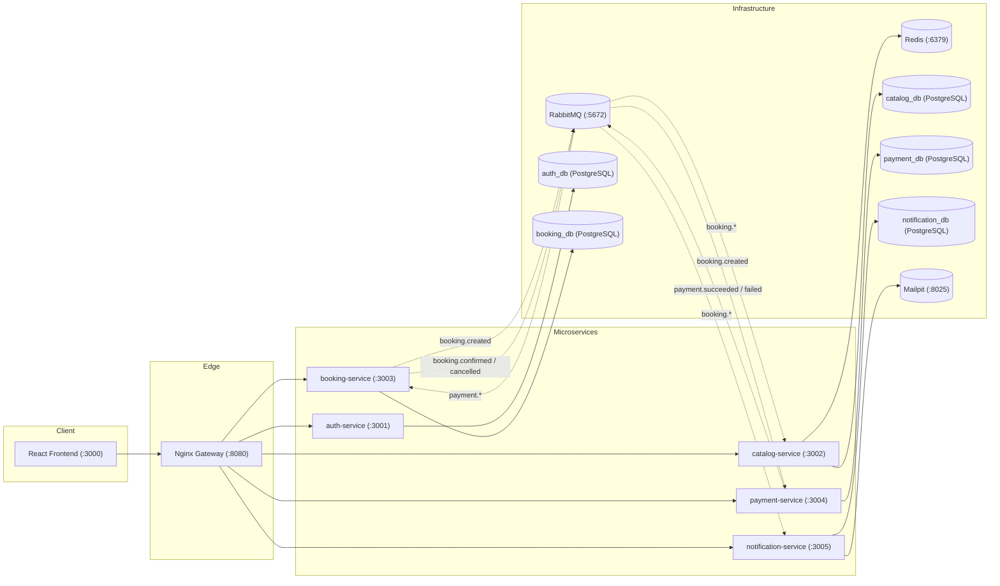

# ✈️ Travel Booking System

[](https://github.com/ZamanAsad007/Travel-Booking-System/actions/workflows/ci.yml)
[](https://nodejs.org/)
[](https://www.docker.com/)
[](LICENSE)

A production-grade, event-driven microservices travel booking application (flights and hotels) built with **Node.js 20**, **Express**, **React + Vite**, **PostgreSQL**, **RabbitMQ**, and **Redis**. Designed to demonstrate clear service boundaries, distributed transactions using the **Saga Choreography Pattern**, and full containerization with **Docker Compose**.

Runs 100% locally with a single command — no external cloud hosting required.

---

## 🏛 Architecture Diagram



---

## 🛠 Tech Stack

| Layer | Technology | Purpose |
|---|---|---|
| **Frontend** | React 18, Vite, React Router 6, TanStack Query, Axios, TailwindCSS | Fast single-page application with responsive UI and caching |
| **Backend Services** | Node.js 20 + Express | Lightweight, uniform RESTful microservices |
| **API Gateway** | Nginx | Central reverse proxy, CORS handler, and URL routing |
| **Databases** | PostgreSQL 16 (per-service databases) | Strictly isolated databases enforcing microservice autonomy |
| **Message Broker** | RabbitMQ (`amqplib`) | Topic exchange `travel.events` for asynchronous Saga events |
| **In-Memory Cache** | Redis (`ioredis`) | Short-lived inventory holds with automatic TTL expiration |
| **Validation & Auth** | Zod, JWT (`jsonwebtoken`), bcrypt | Request schema validation and stateless bearer token authentication |
| **Email Mock** | Mailpit | Web inbox (`http://localhost:8025`) for notification verification |
| **Testing** | Jest, Supertest | Unit testing, API validation tests, idempotency checks |
| **CI / CD** | GitHub Actions | Automated linting, test suites, and Docker image builds |

---

## ⚡ Quick Start

### Prerequisites
- [Docker](https://docs.docker.com/get-docker/) & [Docker Compose](https://docs.docker.com/compose/)
- [Node.js 20+](https://nodejs.org/) (optional for local testing outside Docker)

### One-Command Setup

```bash
# 1. Clone repository
git clone https://github.com/ZamanAsad007/Travel-Booking-System.git
cd "Travel Booking System"

# 2. Setup environment variables
cp .env.example .env

# 3. Build and launch entire microservices stack
docker compose up --build -d
```

### Useful Make Commands
```bash
make up       # Start all containers in the background
make down     # Stop all containers
make build    # Rebuild images and start
make seed     # Seed catalog with flight and hotel sample data
make logs     # Follow live logs across all services
```

---

## 🌐 Application Ports & Endpoints

| Component | Port | URL / Path |
|---|---|---|
| **API Gateway** | `8080` | `http://localhost:8080/` |
| **Frontend UI** | `3000` | `http://localhost:3000/` |
| **Mailpit Web UI** | `8025` | `http://localhost:8025/` |
| **RabbitMQ Management** | `15672` | `http://localhost:15672` (guest / guest) |
| **Auth Service** | `3001` | `/api/auth` (via gateway) |
| **Catalog Service** | `3002` | `/api/catalog` (via gateway) |
| **Booking Service** | `3003` | `/api/bookings` (via gateway) |
| **Payment Service** | `3004` | `/api/payments` (internal + read) |
| **Notification Service** | `3005` | `/api/notifications` (internal + read) |

---

## 🔄 Saga Choreography Flow

The system coordinates booking transactions across distributed services using an asynchronous **Saga (Choreography)** pattern:

```
1. Client POST /api/bookings
   └─ Booking Service creates booking in PENDING state
   └─ Calls Catalog Service to place temporary hold on inventory (Redis TTL: 10 mins)
   └─ Emits `booking.created` event to RabbitMQ topic exchange `travel.events`

2. Payment Service consumes `booking.created`
   └─ Processes payment (mock processor with configurable success rate)
   └─ Emits `payment.succeeded` or `payment.failed` event

3. Booking Service consumes payment event:
   ├─ If succeeded: Updates booking to CONFIRMED, emits `booking.confirmed`
   └─ If failed: Updates booking to CANCELLED, emits `booking.cancelled`

4. Catalog Service consumes booking event:
   ├─ On `booking.confirmed`: Converts temporary Redis hold into permanent DB reservation
   └─ On `booking.cancelled`: Releases Redis hold immediately

5. Notification Service consumes confirmation/cancellation:
   └─ Renders email template and delivers message to Mailpit SMTP
```

---

## 🧪 Testing

### 1. Unit & API Tests
Run the Jest test suite covering business logic, state machine transitions, event idempotency, and API route validations:

```bash
npm test
```

### 2. End-to-End Happy Path Verification
Run the automated end-to-end integration script that exercises the full journey (`Register -> Search Flights -> Submit Booking -> Poll Saga for Confirmation`):

```bash
# Ensure docker compose stack is running
npm run test:e2e
```

### 3. Code Formatting Check
```bash
npm run format:check
```

---

## 📐 Design Decisions & Trade-offs

1. **Saga Choreography vs. Orchestration**:
   - *Decision*: Choreography was chosen to avoid a single point of coordination failure and keep services loosely coupled via standard event contracts.
   - *Trade-off*: Event flows require clear tracing and message contracts to prevent cycle complexity.

2. **Redis Inventory Holds with TTL**:
   - *Decision*: Short-lived inventory reservations live in Redis with a TTL of 10 minutes rather than pessimistic database row locking in PostgreSQL.
   - *Trade-off*: Avoids database lock contention during high-traffic checkout flows. If payment drops or times out, the inventory hold automatically expires and frees up seats/rooms.

3. **Strict Database Isolation**:
   - *Decision*: Each microservice owns its own isolated PostgreSQL database schema (`auth_db`, `catalog_db`, `booking_db`, `payment_db`, `notification_db`).
   - *Trade-off*: Direct cross-table SQL joins are eliminated, enforcing clean domain boundaries and true microservice autonomy.

4. **Consumer Idempotency**:
   - *Decision*: Every event message contains a UUID `eventId`. Consumers persist processed message IDs in a `processed_events` table within their own database. Duplicate event arrivals are automatically ignored.

---

## 🚀 What I'd Improve (Production Roadmap)

- **Transactional Outbox Pattern**: Use Debezium or an Outbox table to guarantee dual-write consistency between Postgres transactions and RabbitMQ event publication.
- **Asymmetric Key JWTs**: Migrate from shared secret HMAC tokens to RS256 / EdDSA public/private key pairs issued by an OAuth2/OIDC identity provider.
- **OpenTelemetry & Distributed Tracing**: Inject W3C Trace Context headers (`traceparent`) through HTTP requests and AMQP message headers to visualize distributed traces in Jaeger or Zipkin.
- **Kubernetes Helm Charts**: Package deployments, ConfigMaps, and StatefulSets for cloud-native deployment on Kubernetes or AWS EKS.

---

## 📄 License
This project is licensed under the [MIT License](LICENSE).
