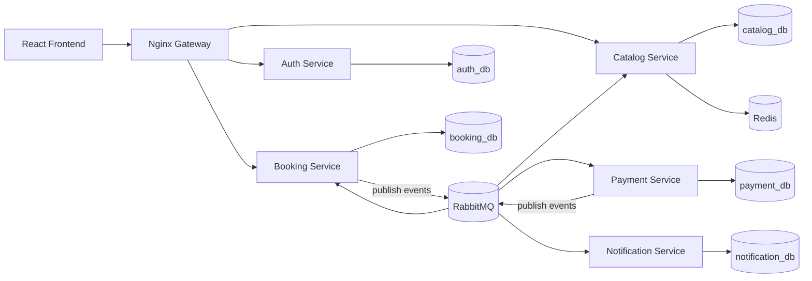

# Travel Booking System

A microservices-based travel booking application (flights + hotels) built to demonstrate containerization with Docker Compose, clear service boundaries, and event-driven architecture (Saga pattern with RabbitMQ).

## Architecture Overview



## Services & Tech Stack

- **Gateway**: Nginx reverse proxy routing requests and handling CORS
- **Auth Service**: User registration, login, JWT issuance, profile
- **Catalog Service**: Flight & hotel search, room inventory, availability
- **Booking Service**: Booking state machine, saga coordinator, reservations
- **Payment Service**: Mock payment processing and refunds
- **Notification Service**: Asynchronous notifications via RabbitMQ
- **Databases**: PostgreSQL (strictly isolated databases per service)
- **Message Broker & Cache**: RabbitMQ & Redis

## Quick Start (Docker Compose)

```bash
cp .env.example .env
docker compose up --build
```

Detailed documentation and phase-wise implementations are referenced in [Design.md](file:///mnt/D-Drive/Projects/Travel%20Booking%20System/Design.md).
